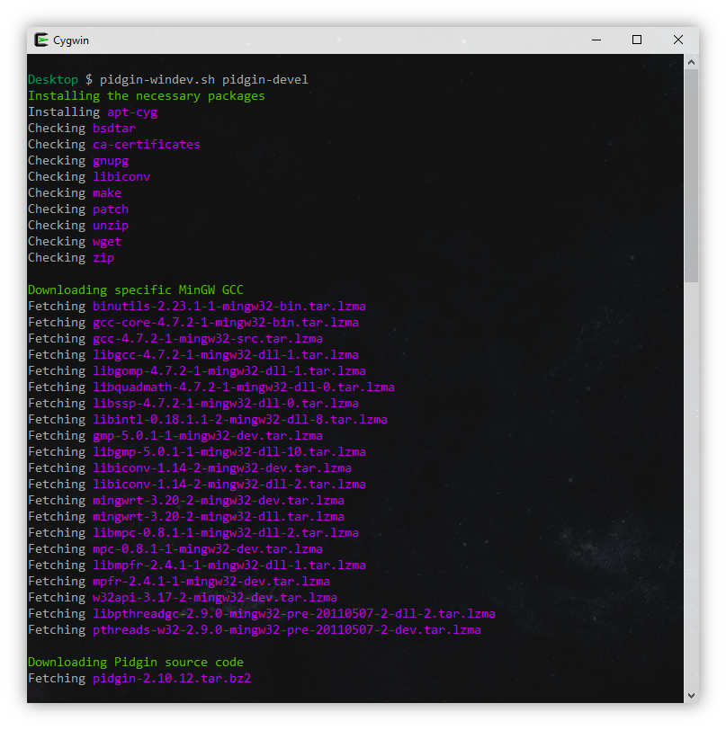

# Pidgin Windev

This Cygwin/MSYS/Linux tool creates a build environment for Pidgin on Windows, automating the manual steps described in the [official documentation](http://developer.pidgin.im/wiki/BuildingWinPidgin).

## License and copyright

Copyright (c) 2012-2018 Renato Silva, Grant Pannell
Licensed under the terms of the [3-clause BSD license](LICENSE).
